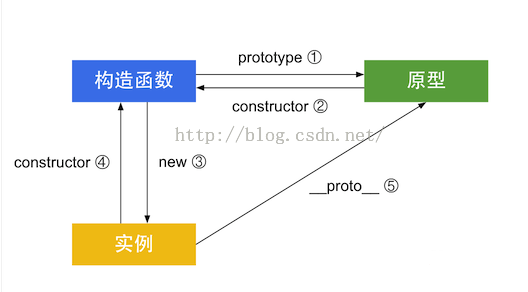

#原型和继承

### 一、原型
说到原型之前，先复习一下对象创建方式：
#### 1. 使用对象字面量的形式创建 (最简单)

```text
<script>

  var obj = { a: 1}
  obj.b = 2
  console.log(obj)

</script>
```
#### 2. 使用工厂函数的方式

```text
<script>

  function CreatePerson (name, age) {
    var obj = new Object ()
    obj.name = name
    obj.age = age
    obj.sayHi = function () {
      console.log('哈喽')
    }
    return obj
  }
  var person1 = CreatePerson('张三', 18)
  var person2 = CreatePerson('李四', 20)

</script>
```

#### 3. 使用构造函数的方式(对工厂函数的改进)

```text
<script>

  function Person (name, age) {
    this.name = name
    this.age = age
    this.sayHi = function () {
      console.log('哈喽')
    }
  }
  var person1 = new Person('张三'，18)
  var person2 = new Person('李四'，20)

</script>
```

+ 用new操作符调用函数时，会自动执行下面的操作
> * 创建（或构造）一个新的对象
> * 这个新对象会执行prototype连接
> * 这个新对象会绑定到函数调用的this
> * 如果函数没有返回其他对象， 那么new表达式中的函数调用自动返回这个新对象


```
//我们来举个例子
var Foo() {
  //这是一个普通函数
}
Foo() //普通函数调用
var a = new Foo()//在普通调用前加一个new关键字后，这个调用就变成了构造函数调用
```

+ new会劫持所有普通函数，并用构造函数的形式调用它
> var a = new Foo() 这句话的执行机制: Foo是一个普通函数，在使用new调用时，它就会构造一个对象，并且赋值给a

+ 简单点来说 js中的 构造函数 ：**所有带new的函数调用**
+ 用new的方法来调用Foo会产生一个新对象a，这个新对象的内部链接__proto__会关联到Foo的原型对象上
 a.__proto__ == Foo.prototype


#### 4. 使用原型的方式

- 原型的初步模式

```text
<script>
  function Person () { }

  Person.prototype.name = '张三'
  Person.prototype.age = 18
  Person.prototype.sayHi = function () {
      console.log('哈喽')
    }

  var person1 = new Person()
  var person2 = new Person()
</script>

```
+ 优点：原型中所有的属性和方法都可以被实例对象共享
+ 缺点：所有的实例对象都公用一套原型和方法，没有差异化，不能修改

######  我们来了解一下实例对象、构造函数和原型之间的联系



- 优化模式（原型重构）
上面例子，每次添加一个属性和方法，就要重新写一遍，比较繁琐，现在把这些属性和方法都放入一个对象中,再赋值给Person的原型

```text
<<script>

  function Person () { }

  Person.prototype = {
    name: '张三',
    age: 18,
    sayHi: unction () {
      console.log('哈喽')
    }
  }

  var person1 = new Person()
  var person2 = new Person()

  console.log(person1.constructor == Person) // false
  console.log(person1.constructor == Object) // true

</script>

```

>  + js 中所有的对象都有一个特殊的内置属性[[prototype]] ,这个属性其实就是用来对其他对象的引用
>  + 这种写方法改变了原型内部的constructor指针的属性了 ，不再指向Person函数了，如果这个指针很重要，那么可以手动设置

```text
<<script>

  function Person () { }

  Person.prototype = {
    constructor：Person,
    name: '张三',
    age: 18,
    sayHi: unction () {
      console.log('哈喽')
    }
  }

  var person1 = new Person()
  var person2 = new Person()

  console.log(person1.constructor == Person) // true
  console.log(person1.constructor == Object) //false

</script>

```


##### 如果要访问对象中的属性，我们要经过哪些机制呢？

```
<script>

  var obj = {
    a: 2
  }

  console.log(obj.a) // 2

</script>


```

### 总结：prototype 的机制

> prototype机制就是存在于对象中的一个内部链接，它会引用其他对象。

> 这个链接的作用就是： **如果在对象上没有找到需要的属性或者方法，引擎就会在prototype关联的对象上进行查找。如果在后者的对象中没有找到这个属性和方法，引擎就会继续查找他的prototype，以此内推，如果没有找到，就会返回underfind。**
这就是所谓的原型链。（有点像嵌套的作用域链）


 - - - - - - - - - - -


### 二、继承
> 构造函数就是初始化一个实例对象，对象的prototype属性是继承一个实例对象。

## 继承的方式：
### 1. 通过原型的方式继承
```text
<script>
  function Bird(legNum, wingNum) {
    this.leg = legNum;
    this.wing = wingNum;
  }
  Bird.prototype.appearance = function () {
    console.log('鸟类都有漂亮的羽毛')
  }
  function Swan (beh,legNum,wingNum) {
    this.behaviour =  beh;
  }
  Swan.prototype = new Bird(2,2,);// 继承了Bird中的属性和方法，但是不能通过传参修改这些值

  Swan.prototype.story = function () {
    console.log('是由丑小鸭变成的');
  }
   // 白天鹅
  var whiteSwan = new Swan('会游泳')
  console.log(whiteSwan)
  whiteSwan.appearance() // 鸟类都有漂亮的羽毛
  whiteSwan.story() // 是由丑小鸭变成的
</script>
```
+ 优点：所有的属性和方法均可以进行继承
+ 缺点：如果继承了属性，属性值在后期无法修改

### 2. 使用call()方法调用实现继承

```text
<script>
  function Person (name, age) {
  this.name = name;
  this.age = age;
  }
  Person.prototype.behaviour = function () {
    console.log('大家好，我是一类人')
  }


  function Man(name, age, gender) {
    Person.call(this, name ,age);
    this.gender = gender;
  }
  //可以创建多个实例对象
  var man1 = new Man('张三', 18, '男')
  var man2 = new Man('李四', 20, '女')
  //但是 不能调用原型中的属性和方法
  console.log(man1)
  console.log(man2)
  man1.behaviour()//会报错,这种方法继承不到Person函数中原型中的属性方法
</script>

```
> call(this, 参数1 , 参数2...)
+ 使用call方法调用中的参数this 把this指向了调用者

>  - 优点：可以继承所有在构造函数体中书写的属性，并且可以进行传参
>  - 缺点： 无法继承原型中的属性和方法


### 3. 组合方式继承（使用call和原型的方式组合继承）

- call方法：继承构造函数体中的属性，并可以传参修改
- 原型方式：可以继承原型链中的属性

+ 看实例

```text
<script>
 // 组合继承
 function Person (name, age) {
    this.name = name;
    this.age = age;
  }
  //Person的原型
  Person.prototype.behaviour = function () {
    console.log('大家好，我是一类人')
  }

  //console.log(Person())//underfined

  //Man 的构造函数
  function Man(name, age, gender) {
    //call调用的方法进行继承，这个方法改变了Man这个构造函数内部的指向（即constructor指针）
    Person.call(this, name ,age);//第二次调用Person
    this.gender = gender;
  }
  //这里的通过new创建了一个实例对象，并把这个实例对象赋值给了Man的原型对象, 所以改变了 Man原型对象的内部指针（constrouctor）
  //原本Man 的原型对象中的constructor指向Man这个函数的，但是现在被改变成指向Person这个函数了

  Man.prototype =  new Person() //第一次调用Person
  //Man 原型对象中的方法
  Man.prototype.action = function () {
    console.log('吃饭、睡觉、打豆豆')
  }
  //可以创建多个实例对象
  var man1 = new Man('张三', 18, '男')
  var man2 = new Man('李四', 20, '女')
  console.log(man1)
  man1.behaviour()
  man1.action()
</script>


```
>  - 优点：所有的属性和方法均可以被继承，并且所有的属性均可自由传参。
>  - 缺点：每调用一次Man构造函数时，就会调用两次Person函数

### 4. 拷贝继承方法  （将原对象进行遍历，把它的属性和方法赋值给新的对象）

+ 看代码

```
<script>
//构造函数
  function Person (name, age) {
    this.name = name;
    this.age = age;
  }
  Person.prototype.behaviour = function () {
    console.log('大家好，我是一类人')
  }

  function Man (name, age, gender) {
    this.gender = gender
    var person = new Person(name,age)
    // 在Man函数内部对Person进行遍历， 把People具有的属性赋值给Man
    for (var k in person) {
      this[k] = person[k]
    }
  }
  Man.prototype.action = function () {
    console.log('吃饭、睡觉、打豆豆')
  }
  //创建实例对象man
  var man = new Man('张三', 18, '男')
  var man2 = new Man('李四', 20, '女')
  console.log(man.name)
  console.log(man.age)
  console.log(man)
  console.log(man2)
  man.behaviour()

</script>
```
+ 优点：可以传参，可以继承到原型中属性和方法


  ### 5. this的方式（这种方式与call的方式类似）

```
<<script>
   //构造函数
  function Person (name, age) {
    this.name = name
    this.age = age
  }
  Person.prototype.behaviour = function () {
    console.log('大家好，我是一类人')
  }

  function Man (name, age, gender) {
  //在Man中添加一个属性people，把People这个函数体赋值给Man的属性people，然后再进行调用
    this.people = Person
    //进行调用
    this.people(name, age)

    this.gender = gender
  }
  Man.prototype = function () {
    console.log('吃饭、睡觉、打豆豆')
  }
  //实例对象
  var man = new Man('张三', 18 , '男')

  console.log(man)
  man.behaviour()// 报错  不能继承到Person原型中的属性方法
  </script>

```

>  - 优点： 可以传参
>  - 缺点：原型内的方法无法继承，并且还多了一个属性people